# 완도 배편·날씨 통합 정보 서비스 **FerryCast** 협력 제안서

### QR코드 부착 허가 및 공식 홍보 협조 요청

> **"오늘 배 뜨나요?"**
> 완도 군민과 관광객이 한 화면에서 바로 확인하는 공익 정보 서비스

| | |
|---|---|
| **제출일** | 2026년 7월 |
| **제안자** | FerryCast 운영자 김신진 |
| **웹주소** | https://ferrycast.kr |
| **연락처** | 010-8478-7552 · climaxna@naver.com |

---

## 목차

1. 제안 배경
2. 무엇이 문제인가
3. 이미 있는 서비스, 그럼에도 FerryCast인 이유
4. 제안하는 서비스
5. 실제 앱 화면
6. 안정적인 운영
7. 추진 방안과 일정 (현장 시범 부착 포함)
8. 완도군의 기대 효과
9. 운영 방식과 지속가능성
10. 예상 우려와 대응
11. 완도군청에 드리는 요청
12. 제안자 의견

---

## 1. 제안 배경

완도에서 배는 도로입니다. 청산도·소안도·보길도 주민에게 여객선은 출퇴근길이고 장 보러 가는 길이며, 관광객에게는 섬에 닿는 유일한 수단입니다.

그런데 이 배가 언제 뜨는지를 알아보는 일이 의외로 번거로웠습니다. 청산도 배 시간을 확인하려고 네이버에 검색하면, 정작 시간표는 누군가 정리해 둔 블로그 글에서 찾아야 했습니다. 그마저 오래된 정보일 때가 많아, 결국 항만 터미널에 전화를 걸어 물어보곤 했습니다. 배편 정보를 모바일 화면에 맞게 한눈에 보여주는 곳을 끝내 찾지 못했습니다.

시간표는 선사마다, 결항은 또 다른 곳에, 날씨와 물때는 각각 다른 사이트에 흩어져 있습니다. 그러다 보니 사람들은 터미널에 도착해서야 "오늘 결항입니다"라는 말을 듣기도 합니다.

FerryCast는 그 흩어진 정보를 **한 화면, 클릭 없는 즉시 확인**으로 모았습니다. 군의 예산이나 인력을 쓰지 않고 민간이 직접 만들어 이미 운영하고 있습니다. 지금 https://ferrycast.kr 에서 바로 열립니다.

---

## 2. 무엇이 문제인가

완도는 기상 변화로 결항이 잦습니다. 그만큼 정보가 중요한데, 정작 그 정보가 흩어져 있습니다.

- **시간표·결항·날씨가 따로 있습니다.** 이용자는 세 곳을 따로 확인해야 합니다.
- **관광객은 어디를 봐야 할지 모릅니다.** 검색해도 선사별·항로별로 흩어져 나와, 터미널에서야 결항을 알게 됩니다.
- **고령 군민에게는 더 어렵습니다.** 여러 사이트를 오가며 작은 글씨를 읽는 일 자체가 장벽입니다.

문제의 진짜 원인은 정보가 없어서가 아닙니다. **정보가 흩어져 있고, 찾는 과정이 어렵기 때문**입니다. 해법은 분명합니다. 한곳에 모으고, 찾는 과정을 없애면 됩니다.

---

## 3. 이미 있는 서비스, 그럼에도 FerryCast인 이유

배편 정보를 다루는 서비스는 이미 있습니다. 숨기지 않고 먼저 밝힙니다.

| 기존 서비스 | 성격 | 한계 |
|---|---|---|
| 가보고싶은섬 / KSA여객선예매 (한국해운조합) | 전국 여객선 **예매** 앱 | 앱 설치·회원가입이 필요합니다. 전국 대상이라 완도만 보려면 검색·선택해야 합니다. 날씨·물때를 제공하지 않습니다 |
| 완도여객선터미널·선사 누리집 | 선사별 시간표 안내 | 항로마다 흩어져 있고, 결항·날씨가 통합되지 않습니다 |
| KOMSA 운항정보 조회 | 운항 현황 페이지 | 일반 이용자에게 접근성이 낮습니다 |

FerryCast는 이들과 **경쟁하지 않습니다. 보완합니다.**

- **목적이 다릅니다.** 기존 앱은 표를 *사는* 곳이고, FerryCast는 "오늘 뜨나"를 *확인하는* 곳입니다. 실제로 FerryCast는 예매 단계에서 한국해운조합 예매 페이지로 연결합니다.
- **설치·로그인이 없습니다.** QR을 비추거나 주소만 입력하면 열립니다. 회원가입 화면이 없습니다.
- **완도에 특화했습니다.** 전국 앱에서 완도를 찾아 들어갈 필요 없이, 완도 항로만 첫 화면에 모았습니다.
- **날씨·파고·물때를 함께 봅니다.** 예매 앱에는 없는 정보입니다. 뱃길은 시간표만으로 판단할 수 없습니다.
- **세부 정보까지 살핍니다.** 예를 들어 완도–제주 항로의 직항편과 추자도 경유편을 구분해 표시합니다. 경유편을 직항으로 알고 탔다가 시간을 더 쓰는 일을 줄입니다.

이미 검증된 예매 시장 위에, 완도 주민·관광객을 위한 **'정보 입구'**를 더하는 것입니다.

민간이 공공데이터로 만든 서비스를 행정이 협력으로 받아들인 선례도 이미 있습니다. 고등학생이 만든 '서울버스' 앱은 이용 수요가 확인되자 지자체가 데이터 협력으로 방향을 바꿨고, 시민 개발자들이 만든 공적마스크 앱과 개인안심번호는 정부가 데이터를 제공하며 공식 채택했습니다. FerryCast는 처음부터 공공 오픈 API를 정식 절차로 사용하고 있어, 데이터 문제 없이 곧바로 협력할 수 있습니다.

---

## 4. 제안하는 서비스

| 기능 | 내용 |
|---|---|
| 실시간 운항 시간표 | 완도 출발·도착 전 항로의 배 시각을 실시간 제공 (완도–제주·청산도·소안도·보길도·노화) |
| 운항 / 결항 표시 | 운항은 파랑, 결항은 빨강으로 직관 표시. 일부 편만 결항돼도 운항 편은 그대로 안내 |
| 날씨 · 파고 | 완도 현재 날씨·바람·습도·파고에 단기예보를 더해 뱃길 가늠 지원 |
| 조석(물때) 예보 | 국립해양조사원 만조·간조 시각과 물높이를 곡선 그래프로 시각화, 5일치 제공 |
| 직항 / 경유 구분 | 같은 항로의 직항편과 경유편(예: 제주–추자도)을 구분 표시 |
| 내일 시간표 미리보기 | 오늘 운항이 모두 끝난 뒤에도 내일 시간표를 바로 확인. 첫 배를 강조 표시해 이른 이동을 계획하는 이용자를 돕습니다 |
| 출항 알림 | 출발 30·10·5분 전 알림 (홈화면 추가 시) |
| 설치 없이 즉시 | QR 또는 검색으로 접속 즉시 모든 정보 표시. 홈화면 추가 시 앱처럼 사용 |

※ 데이터 출처: 한국해양교통안전공단(MTIS 운항 스케줄), 기상청, 국립해양조사원(KHOA) 등 공공 API.

---

## 5. 실제 앱 화면

아래는 실제 서비스 화면입니다. 모든 정보를 스마트폰에서 손가락 한 번으로 확인하도록 설계했습니다.

| ① 메인 화면 | ② 항로 상세 |
|---|---|
| 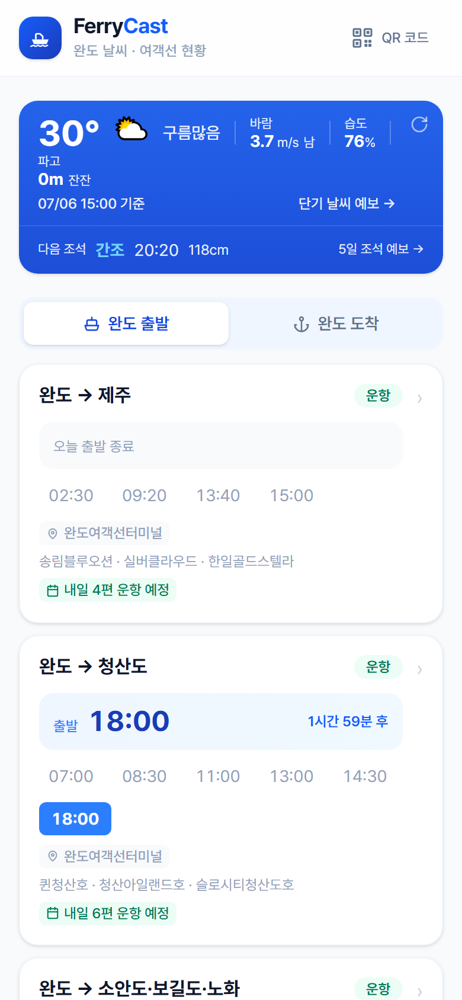 | 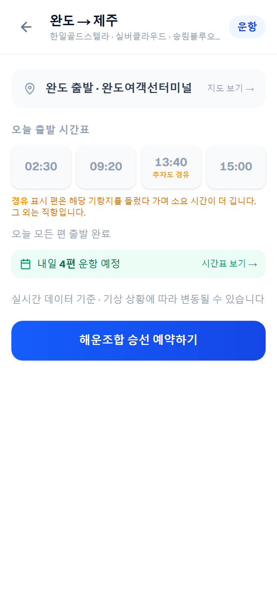 |

| ③ 완도 도착 | ④ 내일 시간표 미리보기 |
|---|---|
| 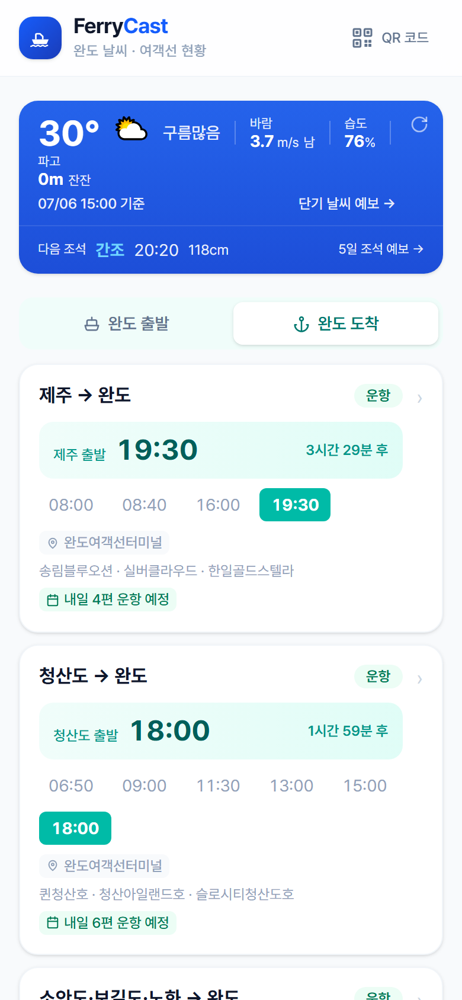 | 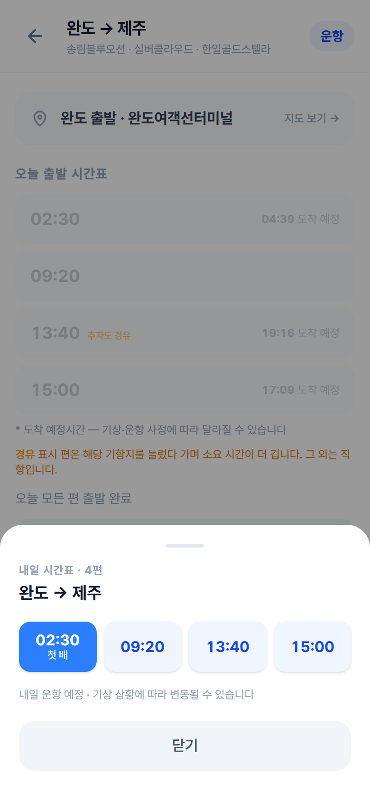 |

| ⑤ 단기 날씨 예보 | ⑥ 조석(물때) 예보 |
|---|---|
| 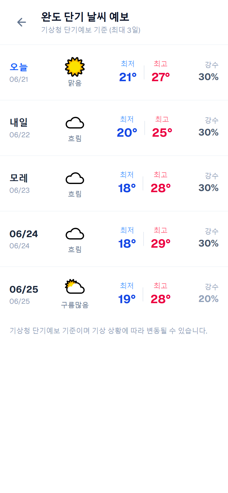 | 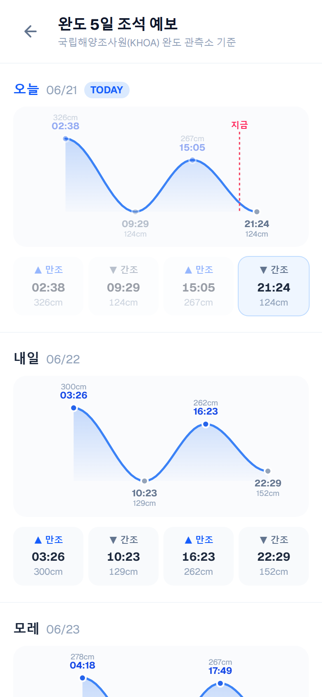 |

| ⑦ 출항 알림 | ⑧ QR 안내물 (인쇄·부착용) |
|---|---|
| 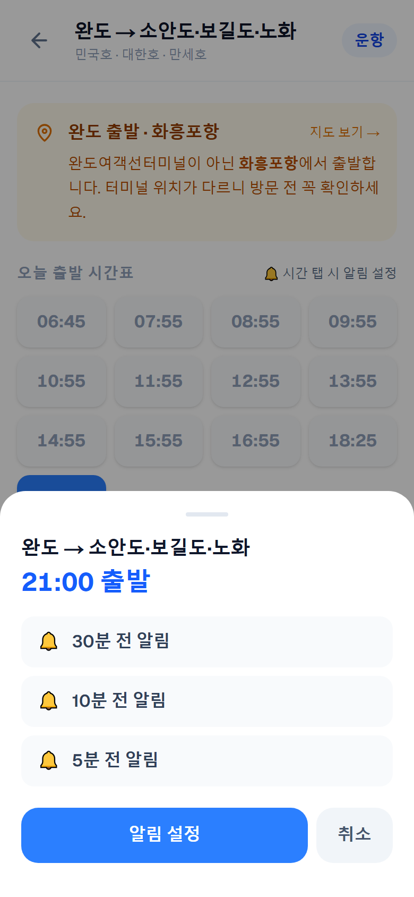 | 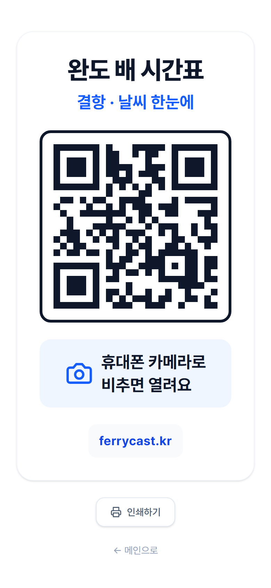 |

- **① 메인 화면** — 열면 클릭 없이 현재 날씨·파고, 다음 만조·간조, 완도 출발 전 항로의 다음 배 시각과 운항·결항 상태가 한 화면에 나옵니다.
- **② 항로 상세** — 오늘 시간표(지난 편은 흐리게, 다음 편은 강조), 공식 운임표, 출발 터미널 지도, 내일 운항 편수를 한곳에 모읍니다. 같은 항로의 **직항·경유(예: 13:40 추자도 경유)도 구분**해 표시합니다.
- **③ 완도 도착** — 섬에서 완도로 돌아오는 배편 시각·운항 상태와 섬에서 타는 터미널 위치를 확인합니다.
- **④ 내일 시간표 미리보기** — 오늘 운항이 끝난 뒤에도 "내일 N편 운항 예정"을 누르면 내일 시간표가 바로 뜹니다. 첫 배를 색으로 강조해, 새벽 이동을 준비하는 이용자가 헤매지 않도록 했습니다.
- **⑤ 단기 날씨 예보** — 기상청 단기예보 기반으로 날씨·최저/최고 기온·강수확률을 큰 글씨와 아이콘으로 보여줍니다.
- **⑥ 조석(물때) 예보** — KHOA 완도 관측소 기준 만조·간조를 **물결 곡선 그래프**로 한눈에 보여주며, 5일치를 제공합니다.
- **⑦ 출항 알림** — 출발 시각을 누르면 30·10·5분 전에 알림을 받습니다(홈화면 추가 시).
- **⑧ QR 안내물** — 터미널·정류장 부착용 인쇄물입니다. "완도 배 시간표 / 결항·날씨 한눈에", "휴대폰 카메라로 비추면 열려요"를 큰 글씨로 담았습니다.

---

## 6. 안정적인 운영

많은 사람이 동시에 사용해도 끊기지 않도록 설계했습니다.

- **공식 공공 데이터.** 해양교통안전공단·기상청·국립해양조사원의 공식 API를 사용합니다.
- **시간표와 결항을 함께.** 하나의 공식 데이터로 동시에 받아 시간표와 결항이 어긋나지 않습니다. 청산농협 차도선 같은 지역 배편까지 실시간으로 표시됩니다.
- **이용자가 늘어도 안정적.** 데이터 호출을 최소화하는 캐시 구조라 접속이 몰려도 무리가 가지 않습니다.
- **빈 화면 없는 안전망.** 일시적 장애에도 흰 화면 대신 참고 시간표를 표시합니다. 언제 열어도 무언가는 반드시 보입니다.
- **완도 밖에서도 검증됐습니다.** 완도에서 다진 이 구조를 포항(울릉도)·목포(제주·홍도·흑산도 등)·인천(백령도·연평도) 항로에도 이미 적용해 함께 운영하고 있습니다. 완도가 이 서비스의 출발점이자, 다른 지역에서도 통한다는 사실을 스스로 증명한 셈입니다.

---

## 7. 추진 방안과 일정

### 이미 현장에 시범 부착했습니다

서비스의 효용을 직접 확인하고자, 자비로 안내물을 제작해 완도여객선터미널과 완도 진입 경로의 거점인 해남종합버스터미널에 시범 부착해 보았습니다. 실제로 공식 운항시간표 바로 옆에서 이용자들이 휴대폰으로 스캔해 배 시각과 결항을 확인합니다.

| 완도여객선터미널 — 운항시간표 옆 | 완도여객선터미널 — 대합실 | 해남종합버스터미널 |
|---|---|---|
| 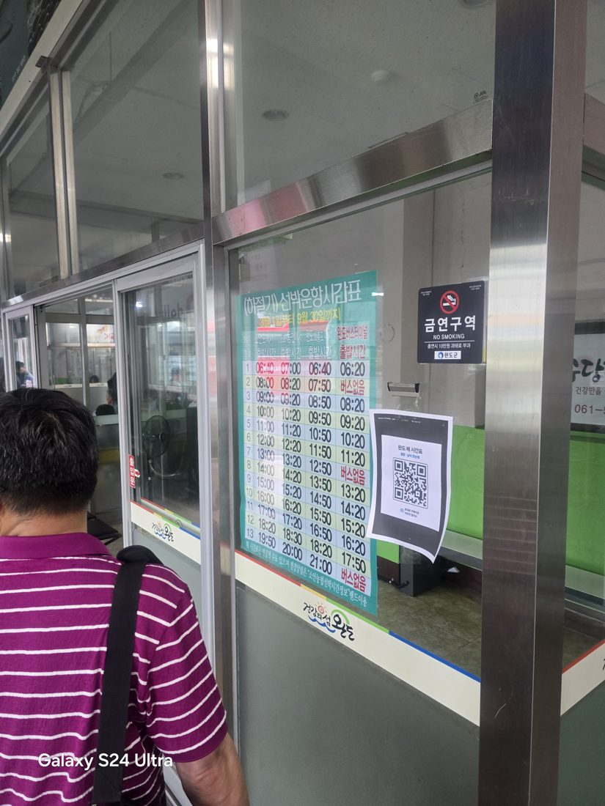 | 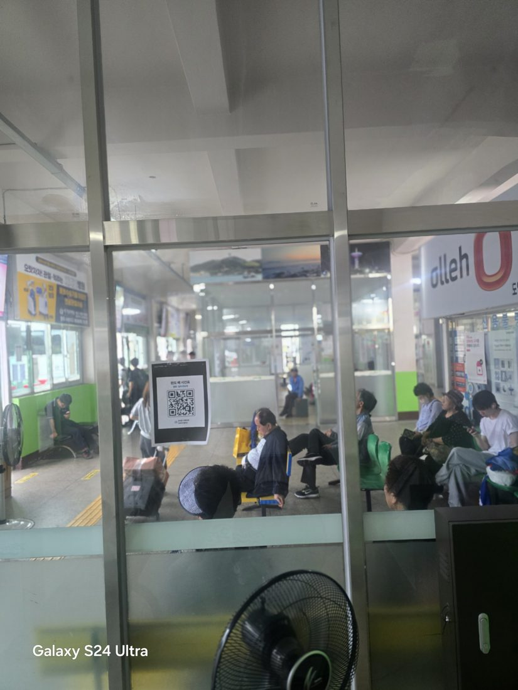 | 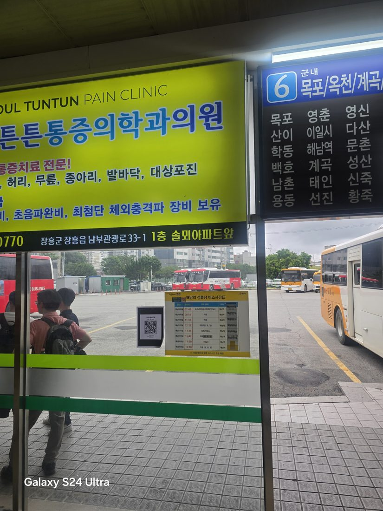 |

다만 지금은 **임시 A4 출력물**이라 비바람·손길에 쉽게 훼손되고, 정식 안내물로 보기 어렵습니다. 효용은 현장에서 확인했으니, 이제 **군의 공식 허가를 받아 내구성 있는 안내물(아크릴·시트지 등)로 정식 설치**하고자 합니다.

### 단계별 계획

| 단계 | 내용 | 완도군 역할 |
|---|---|---|
| 1단계 — 정식화 | 시범 부착 지점을 내구성 있는 정식 안내물로 교체 | 정식 부착 허가 |
| 2단계 — 확대 | 버스터미널·관광안내소 등으로 부착 지점 확대, 누리집·SNS 홍보 | 홍보 협조 |
| 3단계 — 정착 | 이용 현황을 정기 공유하며 항로·기능 보강, 성과를 바탕으로 관광 홍보 연계 등 정식 사업 전환 협의 | 성과 검토·확대 협의 |

장비 설치도, 예산 투입도 없습니다. 현장 효용은 이미 확인했으니, 정식 부착 허가만으로 바로 1단계를 진행할 수 있습니다.

---

## 8. 완도군의 기대 효과

**군민 편의** — 배편·날씨·물때를 한 번에 확인해 헛걸음을 줄입니다. 단순한 화면으로 고령층의 정보 접근성을 높입니다. 완도군은 정부가 지정한 인구감소지역으로, 이 같은 작은 정주 편의도 쌓이면 체감 격차를 줄이는 데 보탬이 됩니다.

**관광객 만족** — 결항을 미리 확인해 일정 차질을 줄입니다. "정보를 쉽게 찾을 수 있는 완도"라는 인상을 남깁니다. 실제로 방문자 대다수가 완도 밖에서 검색·블로그를 통해 유입되고 있어, 여행 전에 배편 정보를 찾는 관광객에게 이미 닿고 있음이 확인됩니다.

**군의 부담 없는 협력** — 예산·인력 투입 없이 민간이 개발·운영합니다. 군은 허가와 홍보만으로 군민 편의 서비스를 제공하는 효과를 얻습니다.

---

## 9. 운영 방식과 지속가능성

FerryCast는 무료 공익 서비스입니다. 배편·날씨 등 핵심 정보는 영구 무료이며 이용자에게 요금을 받지 않습니다.

서버 유지를 위한 최소한의 비용은 두 가지로 충당합니다. 하나는 화면 맨 아래의 지역 광고 자리입니다. 외부 광고망 배너 대신 완도 소상공인(펜션·식당·특산물 판매점 등)을 소개하는 자리로 운영해, 현수막·전단보다 저렴한 비용으로 지역 가게가 완도를 찾는 관광객에게 알려지는 상생 구조를 지향합니다. 다른 하나는 쿠팡 파트너스를 통한 완도 특산물 소개 코너로, 완도산 수산물·특산품을 관광객에게 자연스럽게 알리는 효과도 함께 냅니다. 제휴 구매 시 발생하는 수수료는 전액 서버 운영비로 사용됩니다.

| 구분 | 내용 |
|---|---|
| 지역 소상공인 광고 | 화면 하단 작은 영역에만 게재. 외부 광고망 대신 완도 가게(펜션·식당·특산물 등)를 소개하는 지역 상생형 광고 자리 |
| 쿠팡 파트너스 (완도 특산물) | 완도 특산물을 소개하는 캐러셀 배너. 이용자에게는 정보, 지역에는 노출 효과, 운영자에게는 수수료 |
| 정보 무료 | 배편·날씨·물때 등 핵심 정보는 영구 무료. 이용자에게 요금을 부과하지 않음 |

아래는 실제 배치 화면입니다. 항로 시간표·날씨·조석 등 핵심 정보를 모두 확인한 다음, 화면 맨 아래에서만 특산물 소개와 배너가 나타납니다.

| 화면 하단 배치 |
|---|
| 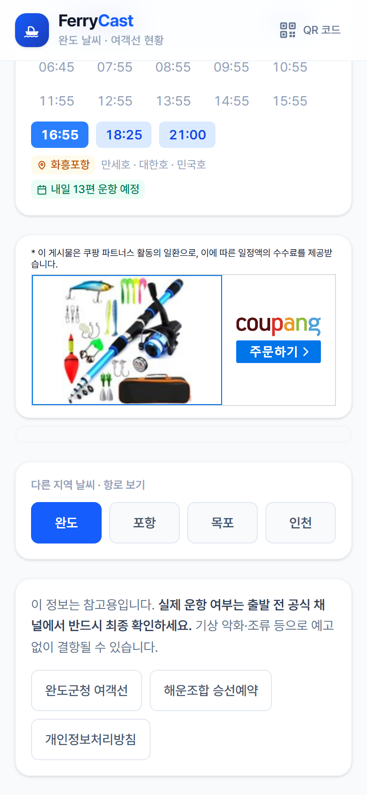 |

운영 수익은 서버 유지와 서비스 개선에 사용되며, 군의 예산 부담 없이 서비스를 안정적으로 지속하기 위한 수단입니다.

---

## 10. 예상 우려와 대응

| 우려 | 대응 |
|---|---|
| 정보가 틀리면 책임은? | 모든 정보는 공식 공공 API를 기반으로 하며, 화면마다 "출발 전 공식 채널에서 최종 확인" 안내를 함께 표시합니다. FerryCast는 공식 정보의 입구이지 대체가 아닙니다. |
| 선사·공식 정보와 충돌하지 않나? | 같은 공공 데이터를 그대로 보여주므로 충돌하지 않습니다. 예매는 한국해운조합으로 연결합니다. |
| 광고가 공익성을 해치지 않나? | 위 9번 화면처럼 광고·특산물 코너는 핵심 정보를 모두 확인한 화면 맨 아래에만 있습니다. 광고 자리도 외부 광고망 대신 완도 소상공인 소개 자리로 운영해 지역에 환원되는 구조입니다. |
| 실제로 쓰이고 있다는 근거가 있나? | 2026년 7월 기준 하루 100여 명이 방문하고 있습니다. 별도 광고 없이 현장 QR 부착과 온라인 소개만으로 얻은 수치이며 꾸준히 늘고 있습니다. 현장에서도 이용자가 QR을 스캔해 확인하는 모습을 직접 확인했습니다(7번 참고). 정식 부착 이후에는 일간 접속자 추이를 정기적으로 완도군청에 공유해 드리겠습니다. |
| 운영자가 그만두면 끊기지 않나? | 공공 API 기반이라 구조가 단순합니다. 군과 협의해 지속 방안(자료·운영 인수 등)을 열어 두겠습니다. |

---

## 11. 완도군청에 드리는 요청

| No | 요청 항목 | 세부 내용 |
|---|---|---|
| 1 | 정식 부착 허가 | 여객선터미널 등 완도 공공장소에 내구성 있는 QR 안내물 정식 부착 허가 (현재 임시 시범물 → 정식 안내물로 교체) |
| 2 | 공식 홍보 협조 | 완도군 누리집·SNS 등 공식 채널을 통한 서비스 소개 게시 |
| 3 | 정보 정확성 협의 (선택) | 정확한 정보 제공을 위한 데이터·운영 의견 교류 |
| 4 | 지역 상권 연계 협조 (선택) | 서비스 내 지역 소상공인 소개 자리(광고)·특산물 코너를 완도 업체와 연결할 수 있도록 관련 부서·단체(수협·농협·상인회 등) 소개 협조 |

---

## 12. 제안자 의견

저는 이 서비스를 직접 만들어 운영하고 있습니다. 기획서가 아니라 **이미 동작하는 서비스**를 들고 왔습니다. 지금 https://ferrycast.kr 에 접속하면 오늘 완도의 배편과 날씨, 물때가 그대로 보입니다. 말로만 제안하지 않고, 자비로 안내물을 만들어 터미널 현장에 직접 시범 부착까지 해보았습니다.

완도에서 시작한 이 서비스는 그 뒤 포항·목포·인천의 여객선 정보에도 같은 구조로 적용되어 함께 운영되고 있습니다. 완도가 이 모델의 출발점이며, 계속 손봐 가며 키우고 있다는 뜻입니다.

저는 완도에서 태어났고, 지금도 부모님이 완도에 계십니다. 완도를 오가며 직접 겪은 불편에서 이 서비스를 시작했습니다. 완도에 대한 애정이 이 일을 계속하는 이유이고, 그래서 한때의 프로젝트로 끝내지 않고 꾸준히 운영하려 합니다.

군의 예산도 인력도 쓰지 않습니다. 완도 군민과 완도를 찾는 사람들이 "오늘 배 뜨나요?"를 더 쉽게 확인하도록, 작은 협력을 부탁드립니다.

---

### 맺음말

FerryCast는 작은 서비스입니다. 그러나 배를 한 번 놓치면 하루가 바뀌는 완도에서, 이 작은 확인 하나가 적지 않은 헛걸음을 막을 수 있다고 믿습니다. 완도군청의 부착 허가와 홍보 협조를 부탁드립니다.

**문의** — FerryCast(페리캐스트) · https://ferrycast.kr · 김신진 · 010-8478-7552 · climaxna@naver.com
